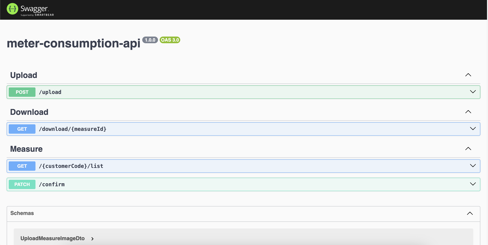

# meter-consumption-api

## Objetivo
Ler imagens de medidores de gás e água e determinar o consumo utilizando a api do Google Gemini.
É possível encontrar algumas imagens de medidores dentro do diretório `images`.

## Rodando
Utilizando o docker-compose, rode o seguinte comando no terminal dentro do diretório do projeto:
> docker-compose up

# Swagger
Acesse o swagger da API através do path `/swagger`.
